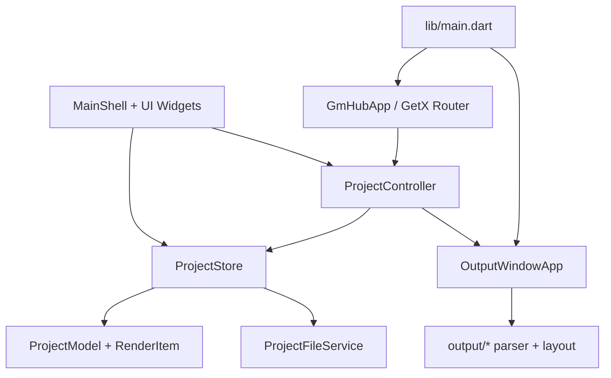
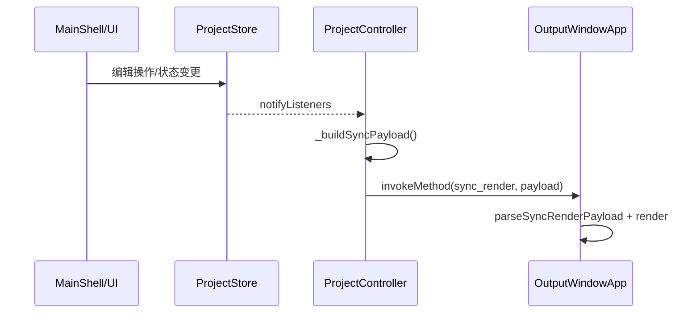
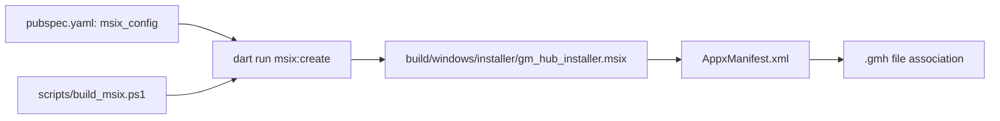

# System Dependencies

> generated_by: nexus-mapper v2 (local compatible run)
> verified_at: 2026-04-07
> provenance: dependency graph for Dart is inferred (module-only AST); C/C++ host side is AST-backed.

## Runtime Dependency Map

## Output Sync Sequence

## Packaging Dependency (Installable Distribution)

## Load-bearing Paths
- 输出合同路径：`ProjectStore.buildRenderList` -> `ProjectController._buildSyncPayload` -> `OutputWindowApp._handleMethodCall`
- 保存路径：`main_shell_actions` -> `ProjectController.saveProject*` -> `ProjectStore.saveProject*` -> `ProjectFileService.saveProject`
- 命运骰路径：`dice_panel` -> `DiceControlFacade.rollFateDice` -> `ProjectStore.rollFateDice` -> `pushFlowMessage(简略结果)`

## Risks / Constraints
- `ProjectStore` 仍是状态和行为耦合中心，接口变更影响面广。
- Dart import 边未由 AST 精确输出，跨模块依赖需要人工复核。
- `.git` 缺失，无法利用真实历史验证热点判断。
