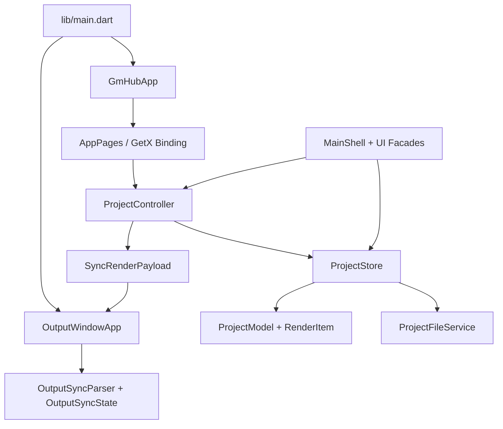
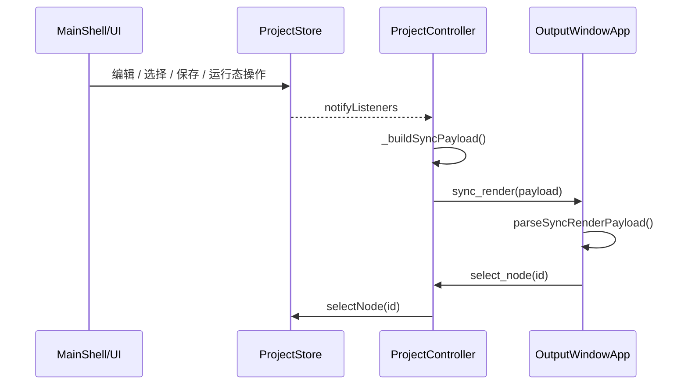
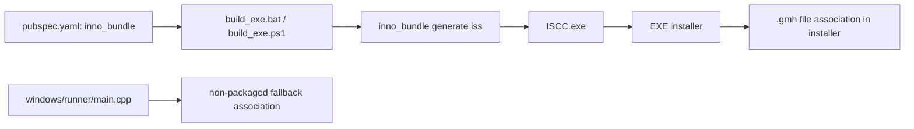

# 依赖关系

> rebuilt_at: 2026-05-08
> note: 基于当前源码导入关系与人工核对，不声称 AST 级完整图

## 运行时依赖图

## 跨窗口交互图

## Windows 打包依赖图

## 承重路径
- 输出合同路径：`ProjectStore.buildRenderList` -> `SyncRenderPayload.fromStore` -> `ProjectController._syncOutputWindow` -> `OutputWindowApp._handleMethodCall`
- 选择回传路径：`OutputWindowApp._selectNode` -> `ProjectController._handleMethodCall` -> `ProjectStore.selectNode`
- 保存路径：`MainShellActions` -> `ProjectController.saveProject*` -> `ProjectStore._saveNow` -> `ProjectFileService.saveProject`
- 安装器路径：`build_exe.bat` / `scripts/build_exe.ps1` -> `inno_bundle` -> `ISCC.exe`
